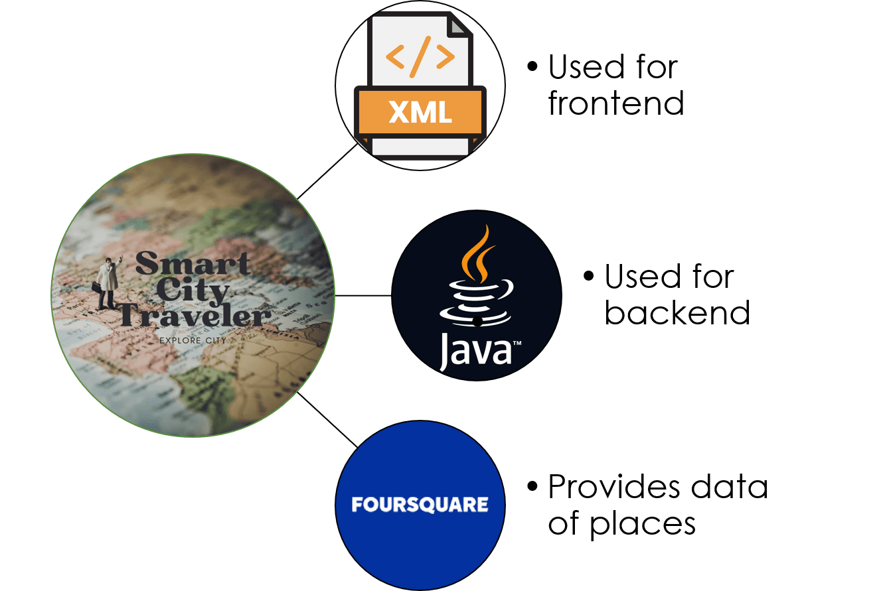
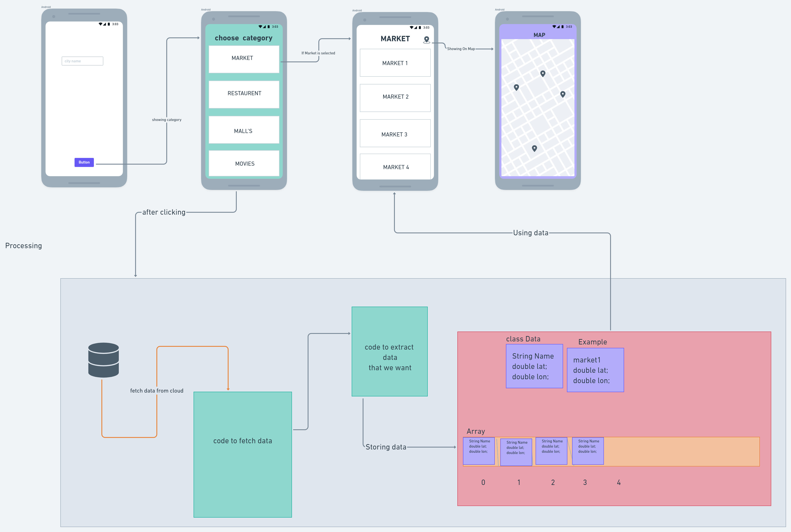
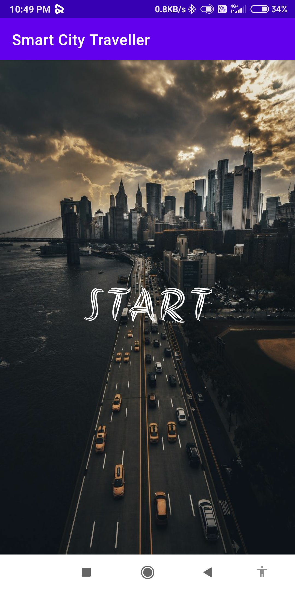
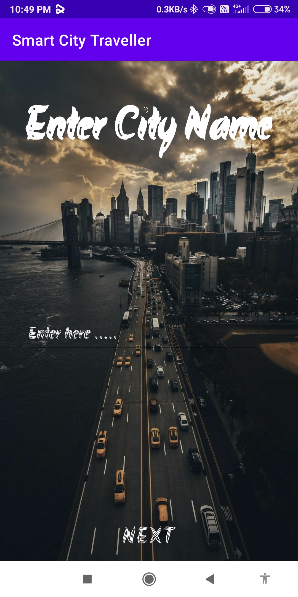
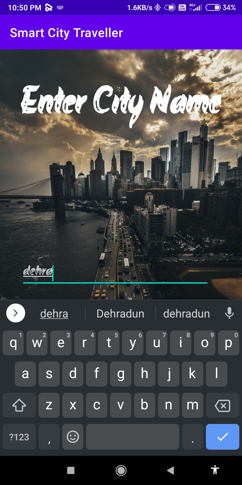
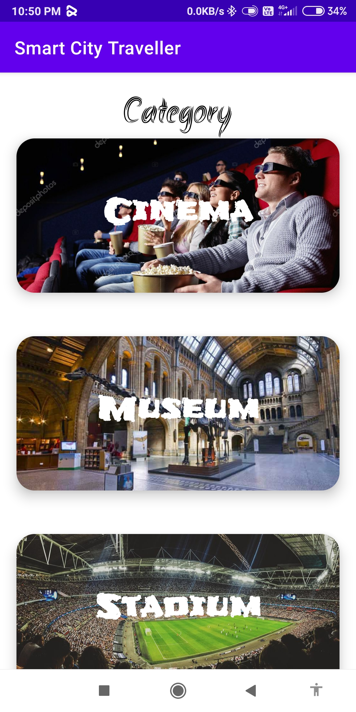
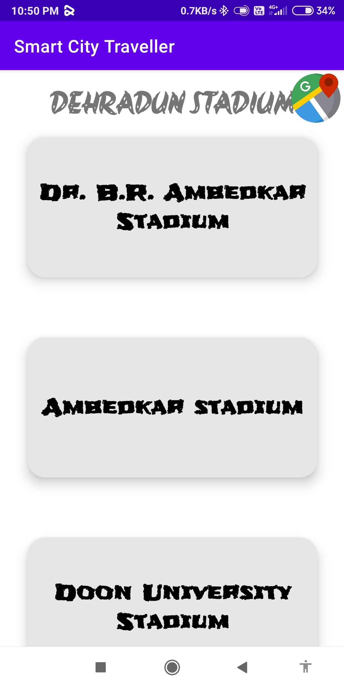
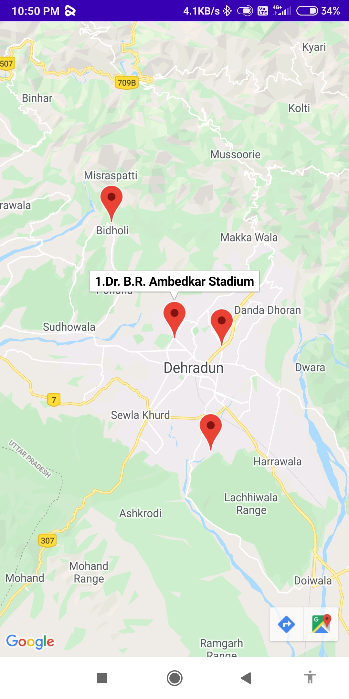

<h1 align="center"> Smart-City-Traveller </h1>

- It is an Application that helps a traveler visiting a city to explore and navigate places of their choice in a very Simple way without typing and deciding which place is best and which is not.

- It is developed using `XML`, `Java` and `Foursquare API`.

## Layout

## Screenshots of the app

### Home Screen

### Input City Name

  

### Choose Category

### Venue List

### Google Map

### How to view path on Google Map from your current location to the venue
- click on the red marker wher you want to go and then 
- click on bottom right corner icons to view the route from the current location to the venue

for demo view video 

# Requirements

- Android Studio
- minimum 4GB RAM
- minimum 2GB Storage
- FourSquare API (version 3 `v3`)
- Google Maps API
- Working Internet Connection

### 1. Changing Foursquare Api
- Login with foursquare account and get Authroization code
- Now go to : [app\src\main\res\values\strings.xml](app\src\main\res\values\strings.xml)
- and replace `AUTH_ID` with your own foursquare authroization code.

### 2. Change the Google Maps Api
- Get [Google Map api](https://developers.google.com/maps/documentation/android/signup)
- Now go to : [app\src\release\res\values\google_maps_api.xml](app\src\release\res\values\google_maps_api.xml)
- and replace the "google_maps_key" with your own google map api key.